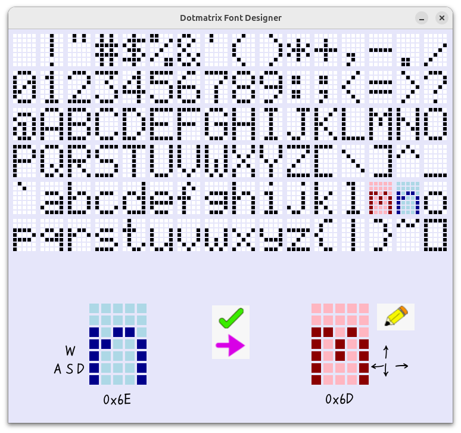
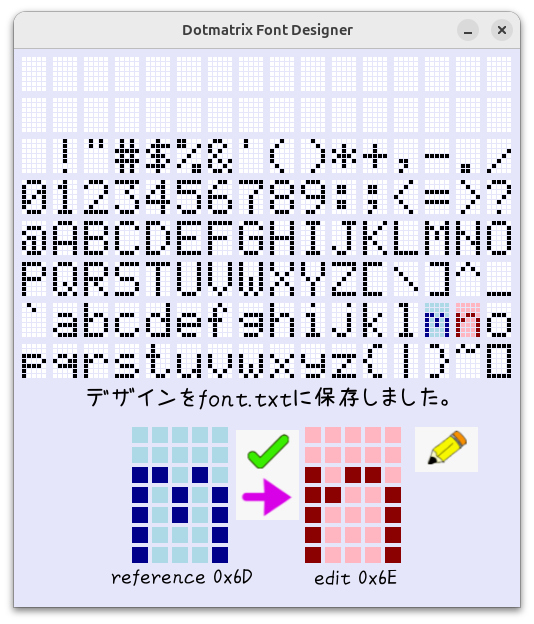

# dotmatrix_font v1.2.0

design and display dotmatrix font for pygame and Minecraft

ドットマトリクスフォントをデザインし、pygameとMinecraftで表示する。



## 注意

**「なつめもじ」フォントを利用しているが、再配布禁止のため、以下のページの一番下の＜＜「なつめもじ」をダウンロード＞＞というリンクからダウンロードすること。**

[あんずいろapricot×color  なつめもじ](http://www8.plala.or.jp/p_dolce/site3-5.html)

nm.zipを展開して得られたnatumemozi.ttfを、fontsフォルダにコピーする。

## Python環境の確認

Python 3.11.9で動作確認済み。とりあえず、動くか試す。

```bash
python designer.py
```

pygameが無い、というエラーが出る場合は、以下のコマンドでインストールする。

```bash
pip install pygame-ce
```

pyenv、poetryがインストールされているか、以下のコマンドで確認する。

```bash
pyenv --version
poetry --version
```

pyenvがインストールされているなら、
pyenvによってPython 3.11.9がインストールされているか確認する。

```bash
pyenv versions
```

Python 3.11.9がない場合は、インストールする。

```bash
pyenv install 3.11.9
```

### pyenvに加え、poetryもインストールされている場合

以下のコマンドで、仮想環境が作成され、その中にpygame-ceがインストールされる。

```bash
poetry install
```

VS Codeの場合は、新しくターミナルを開けば、仮想環境が有効になるはず。
有効になっていない場合は、以下のコマンドで有効にする。

```bash
source .venv/bin/activate
```

あとは、VS Codeが使用するPythonインタープリターを、この仮想環境に設定する。
Pythonファイルを開いている状態で、ウィンドウの下部にPython 3.11.9 ('.venv': Poetry)と表示されていればOK。違う場合は、クリックして選択する。


### poetryはないが、pyenvがインストールされている場合

以下のコマンドでpygame-ceをインストールする。一番最初に試した時にインストール済みだったら、この手順は不要。

```bash
pip install pygame-ce
```

## 概要

- **designer.py**
    ドットマトリクスフォントをデザインするツール

以下、未実装

- **demo_pg.py**
    ドットマトリクスフォントを表示するデモコード
- **demo_mc.py**
    ドットマトリクスフォントをMinecraftで表示するデモコード

## フォントデザインツール　designer.py

**横（COLS、デフォルト5ドット）x縦（ROWS、デフォルト7ドット）のドットマトリクスフォントをデザインする。**

得られるものは、font.txtというファイル。
あるいは、起動時に読み込んだfont.txtの内容を一覧し、一部を編集／保存する使いかたもできる。

### ウィンドウ構成

上部にフォント一覧用の表示領域、左下にデザイン参照用領域（青色）、右下にデザイン編集用領域（赤色）を持つ。
表示領域は、横（DISPLAY_COLS、デフォルト16文字）ｘ縦（DISPLAY_ROWS、デフォルト6文字）の96文字で構成される。

### 操作概要

表示領域でシフトクリックした文字デザインが選択されて青くなり、左下の参照領域に大きく表示される。
表示領域でクリックした文字デザインが選択されて赤くなり、編集領域に大きく表示される。

~~wasdキーの操作で表示領域の中で青く表示される文字が移動し、選ばれた文字デザインが左下の参照領域に大きく表示される。~~
~~上下左右キーの操作で表示領域の中で赤く表示される文字が移動し、選ばれた文字デザインが右下の編集領域に大きく表示される。~~

~~右下の編集領域で、各ドットをクリックすると、そのドットの状態が反転する。~~

鉛筆ボタンのクリック、あるいはEnterキーを押すと、編集領域のデザインが表示領域の赤色表示位置に書き込まれる。

緑色の右矢印ボタンのクリックで、参照領域のデザインが編集領域にコピーされる。

チェックボタンのクリックで、表示領域の全ての文字のデザインデータがfont.txtに保存される。

## 右下の編集領域での動作（クリックによるオンオフ反転動作は廃止）

- クリック、あるいは、ドラッグにより通過したドットはオンになる。
- その時に、シフトキーを押していた場合は、オフになる。
- ドラッグ中にシフトキーの状態を変化させても良い。

## 上部表示領域での選択動作

- クリックで、デザイン用文字の選択（上下左右矢印キーによる移動は削除。）
- シフトクリックで、参照用文字の選択（WASDキーによる移動は削除。）

### フォントデータ

フォントデータはfont.txtに、00000,改行11111,改行 といった改行区切り形式で、すべての文字が連続的に保存される。

起動時にfont.txtが存在しない場合は全て0で初期化して編集開始、
存在する場合は内容を読み込んで編集開始する。また、バックアップとしてfont.txt.bakを作成する。

現状のコードでも、例えば、8x8のフォントを扱うことは可能だが、読み込むfont.txtのデータ形式が一致しないと、エラーになる可能性がある。その場合は、font.txtファイルを削除して、再度designer.pyを起動することで初期化され、編集可能になる。

将来的には、ドットマトリクスの横x縦ドット数についてのデータをfont.txtの先頭に記述する予定。

例えば、5x7の場合は、

```json
[{"cols":5},{"rows":7}]
00000,
11111,
10101,
,,,
```

というような形式。これによって、任意のドット数のフォントデータを柔軟に扱えるようになる。ヘッダーのjson部分に収容文字数、コードの範囲、フォント名などを追加するかもしれない。
